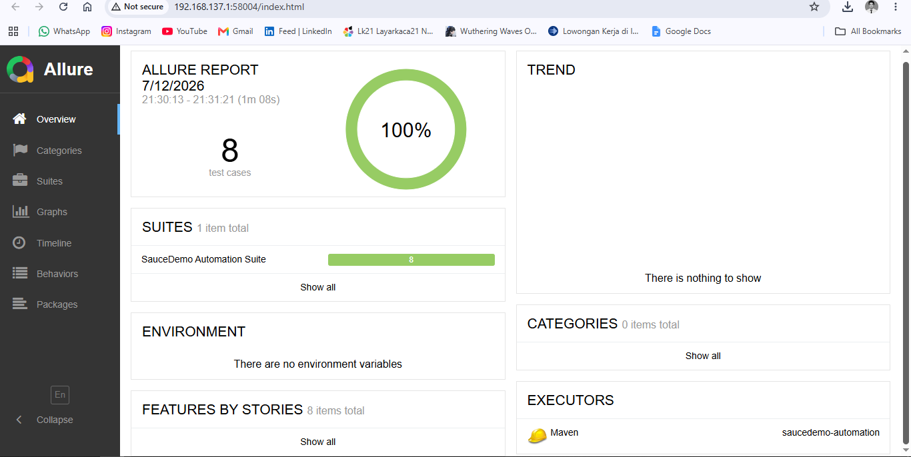
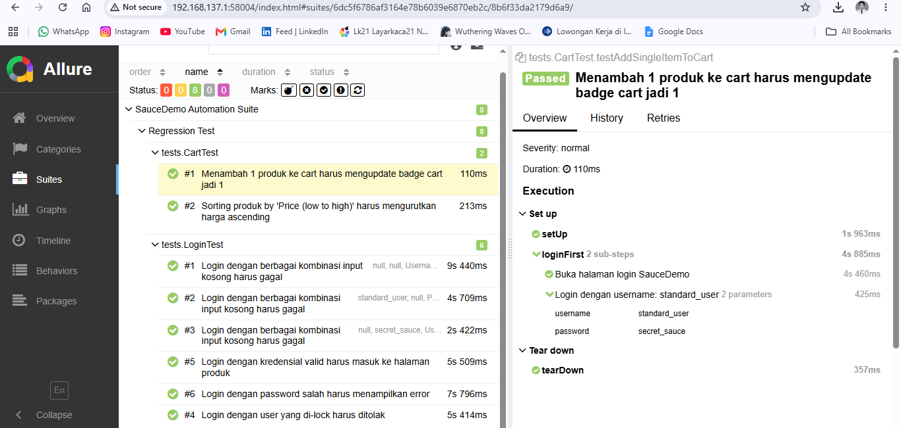
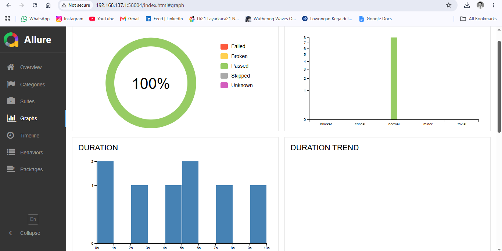
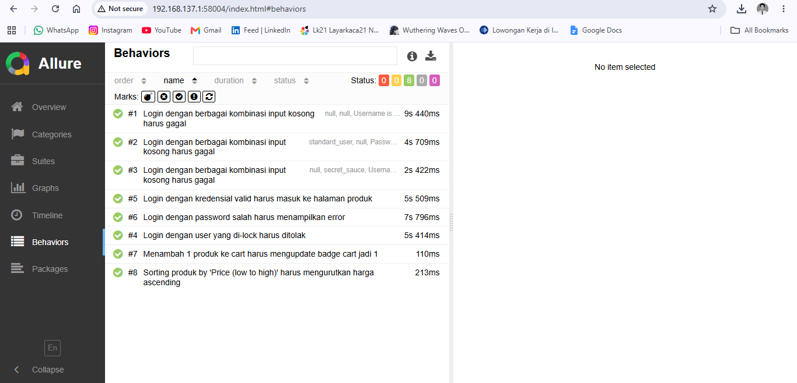

# SauceDemo Automation Testing Project

Proyek automation testing untuk [SauceDemo](https://www.saucedemo.com), sebuah situs e-commerce demo yang memang disediakan untuk latihan QA automation.

## 🎯 Tujuan
Proyek ini dibuat untuk mendemonstrasikan kemampuan automation testing menggunakan Selenium WebDriver dengan Java, meliputi:
- Login testing (positive & negative scenario)
- Cart & sorting functionality testing
- Penerapan Page Object Model (POM)
- Integrasi CI/CD dengan GitHub Actions

## 🛠️ Tech Stack
- **Java 19**
- **Selenium WebDriver 4** — automation engine
- **TestNG** — test runner & assertion
- **WebDriverManager** — auto-manage browser driver
- **Allure Report** — visual test reporting dengan auto-screenshot on failure
- **Maven** — dependency & build management
- **GitHub Actions** — CI/CD pipeline

## 📁 Struktur Proyek
```
saucedemo-automation/
├── src/test/java/
│   ├── pages/              # Page Object classes
│   │   ├── LoginPage.java
│   │   └── InventoryPage.java
│   └── tests/              # Test classes
│       ├── BaseTest.java   # Setup/teardown WebDriver + auto-screenshot on failure
│       ├── LoginTest.java
│       └── CartTest.java
├── src/test/resources/
│   └── allure.properties   # Konfigurasi lokasi Allure results
├── .github/workflows/
│   └── ci.yml              # GitHub Actions pipeline
├── testng.xml               # Test suite configuration
├── screenshots/              # Screenshot hasil test report
│   ├── allure-dashboard.png
│   ├── allure-suites-detail.png
│   ├── allure-graphs.png
│   └── allure-behaviors.png
└── pom.xml
```

## ✅ Test Coverage
| Test Class | Skenario |
|---|---|
| LoginTest | Login sukses, password salah, akun terkunci, field kosong (data-driven) |
| CartTest | Tambah item ke cart, sorting produk by harga |

## 🚀 Cara Menjalankan
```bash
git clone https://github.com/username/saucedemo-automation.git
cd saucedemo-automation
mvn clean test
```

Test report (basic) akan tersedia di `target/surefire-reports/`.

## 📊 Allure Report

Proyek ini sudah terintegrasi dengan **Allure Report** untuk visualisasi hasil test yang lebih informatif — lengkap dengan grafik pass/fail, kategori kegagalan, durasi tiap test, step-by-step detail, dan **screenshot otomatis saat test gagal**.

### Prasyarat
Install Allure commandline (sekali saja):
```bash
# macOS
brew install allure

# Windows (scoop)
scoop install allure

# Manual: download dari https://github.com/allure-framework/allure2/releases
```

### Cara melihat report
```bash
# 1. Jalankan test (hasil otomatis tersimpan di target/allure-results)
mvn clean test

# 2. Generate & buka report di browser
mvn allure:serve
```
Perintah `allure:serve` otomatis generate report dan membukanya di browser secara lokal — tidak perlu deploy ke mana pun.

Alternatif, generate report statis ke folder (untuk di-hosting/dishare):
```bash
mvn allure:report
# hasil ada di target/site/allure-maven-plugin/index.html
```

### Yang bisa dilihat di report
- ✅ Overview: jumlah pass/fail/skip dan durasi total
- 📋 Suites: hasil per test class dengan step-by-step (misal "Login dengan username: standard_user")
- 📸 Attachment: screenshot otomatis ter-lampir di setiap test yang gagal
- 📈 Trend: riwayat hasil test antar run (kalau dijalankan berkali-kali di CI)

> **Tips portofolio:** setelah generate report, screenshot tampilan dashboard Allure dan masukkan ke README atau LinkedIn post kamu. Recruiter biasanya lebih tertarik lihat report visual daripada baca kode mentah.

## 📸 Contoh Hasil Test Report

Berikut hasil eksekusi test suite ini — 8 test case, 100% pass rate:



Dashboard menampilkan ringkasan hasil test, daftar suite, dan trend eksekusi. Detail step-by-step tiap test (termasuk screenshot otomatis kalau ada yang gagal) bisa dilihat dengan klik menu **Suites** di sidebar.

Berikut contoh detail salah satu test case di menu **Suites** — terlihat step-by-step eksekusinya lengkap dengan parameter yang digunakan (`username` dan `password`), berkat anotasi `@Step` yang diterapkan di Page Object:



Menu **Graphs** memvisualisasikan hasil test dalam bentuk chart — status pass/fail, severity, dan distribusi durasi tiap test:



Menu **Behaviors** mengelompokkan semua test berdasarkan deskripsi yang ditulis di `@Test(description = "...")`, memudahkan melihat cakupan skenario testing secara ringkas:



## 📌 Yang Dipelajari
- Menerapkan Page Object Model agar test maintainable dan tidak duplikatif
- Menangani explicit wait untuk menghindari flaky test
- Data-driven testing menggunakan TestNG DataProvider
- Menjalankan test otomatis di CI/CD pipeline (headless mode)

## 🔜 Rencana Pengembangan
- Menambahkan test checkout end-to-end
- API testing untuk backend SauceDemo (jika tersedia)
- Menambahkan Allure history/trend dengan menyimpan `allure-results` antar run di CI

---
*Proyek ini dibuat sebagai bagian dari portofolio pribadi untuk mempelajari QA Automation.*
